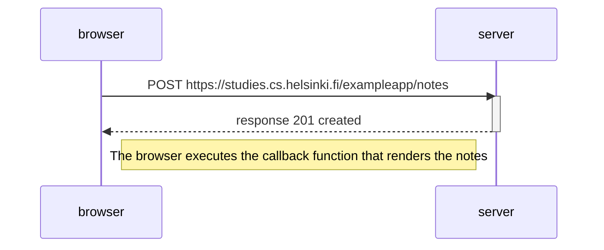

```mermaid

sequenceDiagram
    participant browser
    participant server

    browser->>server: POST https://studies.cs.helsinki.fi/exampleapp/notes
    activate server
    server-->>browser: response 201 created
    deactivate server

    Note right of browser: The browser executes the callback function that renders the notes
```
